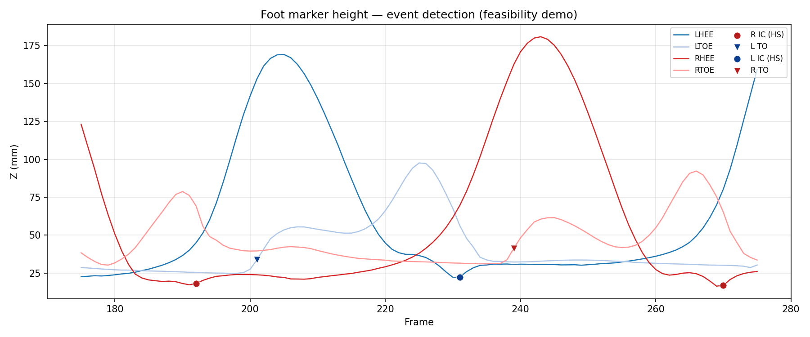

# Spatiotemporal Gait Analysis for Obstacle Crossing

## Overview / Highlights

**Problem:** After labeling, each obstacle-crossing trial needs **reliable IC/TO frames and spatiotemporal parameters** (stride/step timing, speed, obstacle lead/trail context)—without assuming a clean treadmill gait or a fixed heel-strike only pattern.

**Highlights:** **Pelvis-independent** foot-based event detection: heel/toe kinematics, **Z-minimum–priority IC** with descent-velocity peaks, and explicit **heel-strike vs toe-strike (TS)** classification for landings after the obstacle. Automatic **walking setup and obstacle lead/trail** classification; batch export to `per_stride_data.csv` / `per_step_data.csv` with leg-length–normalized metrics and cohort outlier flags.

## Installation

```bash
git clone https://github.com/yesiam0225/gait-spatiotemporal.git
cd gait-spatiotemporal
pip install -e .
```

This installs the import name `spatiotemporal` and the CLI command `spatiotemporal-gait`.

## Command-line interface

After installation, you can run the same entrypoint as `python -m spatiotemporal`:

```bash
# Single trial: marker CSV → per-stride CSV (+ per-step CSV alongside by default)
spatiotemporal-gait --input trial.csv --output strides.csv \
  --leg-length-mm 850 --subject-id SUBJ01 --group adult --board RB --time pre --trial 5
# Optional: spatiotemporal-gait ... --output-step custom_steps.csv

# Batch: manifest CSV (csv_path + trial per row) + output directory
spatiotemporal-gait --trial-manifest trials.csv --output-dir ./out \
  --leg-length-mm 960 --subject-id SUBJ01 --group adult --board RB --time pre
# If every row includes leg_length_mm, --leg-length-mm may be omitted.
# Optional manifest columns (override CLI when present): subject_id, group, board,
# time, leg_length_mm, mass_kg, age_years, height_mm. Aliases: path/input/file for
# csv_path; trial_number for trial; leg_length for leg_length_mm; subject, mass, age, height.

# Batch: JSON spec (positional path)
spatiotemporal-gait analysis_spec.json
```

Use `spatiotemporal-gait --help` for all options.

## Features

- **Pelvis-independent gait event detection** using foot kinematics only (heel and toe markers)
- **Robust to atypical landing patterns** including toe-strike (TS) landings common after obstacle crossing
- **Z-minimum priority algorithm** for heel-strike detection, handling biphasic heel-rocker landings where velocity sign changes occur multiple times per cycle
- **Automatic obstacle detection** and lead/trail foot classification
- **Stride-level parameters** including stride length, stride time, stance/swing percentages, single/double support, gait speed, step length, step time, step width
- **Anthropometric normalization** by leg length and √(g/L) for cross-subject comparison
- **IQR-based outlier flagging** within group, with optional physiological bounds
- **Six CSV outputs** at different aggregation levels (per stride / **per step** / per trial × phase / per trial obstacle / per subject / per subject obstacle)

## Requirements

- Python 3.10+
- NumPy, SciPy, pandas (installed automatically with `pip install -e .`)

## Input Format

CSV file with one column per marker coordinate, named as `MARKER_axis` where axis is `x`, `y`, or `z`. A `frame` column is required. Example markers:

- `LHEE`, `LTOE` — left heel and toe
- `RHEE`, `RTOE` — right heel and toe
- `LASI`, `RASI` — left and right ASIS (anterior superior iliac spine) for walking setup and step width
- `OBSTACLE_L`, `OBSTACLE_R` — obstacle marker pair (configurable name)

Units are millimeters. Sampling rate is configurable (default 100 Hz, matching Vicon standard for full-body capture).

Example column names: `frame`, `LHEE_x`, `LHEE_y`, `LHEE_z`, `LTOE_x`, ..., `OBSTACLE_L_z`.

## Quick Start

### Single trial analysis

```python
from spatiotemporal import analyze_trial, TrialMetadata, Anthropometry

records, obstacle, events, setup = analyze_trial(
    csv_path='SUBJ01_Trial_05.csv',
    metadata=TrialMetadata(
        subject_id='SUBJ01',
        group='adult',
        board='RB',
        time='pre',
        trial=5,
    ),
    anthro=Anthropometry(leg_length_mm=850, age_years=30),
)

# events: GaitEvents with left_hs, right_hs, left_to, right_to,
#          left_strike_types, right_strike_types ('HS' or 'TS')
# records: list of StrideRecord (one per stride)
# obstacle: ObstacleParameters (foot clearances, crossing speed, etc.)
# setup: WalkingSetup (walking axis, direction, obstacle position)

for hs, strike in zip(events.left_hs, events.left_strike_types):
    print(f"Left IC frame {hs+1}: {strike}")
```

### Multi-trial batch with CSV output

```python
from spatiotemporal import analyze_trials, TrialMetadata, Anthropometry

trial_specs = []
for trial_num in range(1, 7):
    trial_specs.append({
        'csv_path': f'data/SUBJ01_Trial_{trial_num:02d}.csv',
        'metadata': TrialMetadata(
            subject_id='SUBJ01',
            group='adult',
            board='RB',
            time='pre',
            trial=trial_num,
        ),
        'anthropometry': Anthropometry(leg_length_mm=850, age_years=30),
    })

paths = analyze_trials(
    trial_specs=trial_specs,
    output_dir='./output',
    sampling_rate=100.0,
)
# paths: dict with keys 'per_stride', 'per_step', 'per_trial_phase', 'per_trial_obstacle',
#        'per_subject', 'per_subject_obstacle' mapping to CSV file paths
```

## Output Files

| File | Unit of analysis | Use case |
|------|------------------|----------|
| `per_stride_data.csv` | One row per stride | Detailed inspection, custom aggregation |
| `per_step_data.csv` | One row per foot IC (landing) | Step time/length/width at each contact |
| `per_trial_phase_summary.csv` | Trial × phase mean | Trial-level comparison |
| `per_trial_obstacle.csv` | Trial | Obstacle-crossing kinematics |
| `per_subject_summary.csv` | Subject × board × time × phase mean | ANOVA-ready (group × board × time) |
| `per_subject_obstacle_summary.csv` | Subject × board × time mean | ANOVA-ready obstacle parameters |

### Key columns in `per_step_data.csv`

- **Identification**: `subject_id`, `group`, `board`, `time`, `trial`, `step_idx_in_trial` (chronological), `landing_side`, `phase`
- **Contact**: `ic_frame`, `ic_strike_type`, `prev_opposite_ic_frame` (previous opposite-foot IC, if any)
- **Step metrics**: `step_time_s`, `step_length_mm`, `step_width_mm` and `*_norm`
- **Link**: `stride_idx_in_trial` (matching row in `per_stride_data.csv`), `outlier_flag`

### Key columns in `per_stride_data.csv`

- **Identification**: `subject_id`, `group`, `board`, `time`, `trial`, `stride_idx_in_trial`, `side`, `phase`
- **Event frames**: `hs_start_frame`, `hs_end_frame`, `to_frame`, `opp_hs_frame`, `opp_to_frame`, `ic_start_strike_type` ('HS' or 'TS')
- **Temporal**: `stride_time_s`, `stance_pct`, `swing_pct`, `double_support_1_pct`, `double_support_2_pct`, `single_support_pct`, `step_time_s`
- **Spatial**: `stride_length_mm`, `gait_speed_m_s`, `step_length_mm`, `step_width_mm`
- **Normalized**: `stride_length_norm`, `stride_time_norm`, `gait_speed_norm`, `step_length_norm`, `step_time_norm`, `step_width_norm`
- **Quality**: `outlier_flag` (IQR-based within group)

## Stride Phase Classification

Each stride is automatically labeled by its position relative to the obstacle:

- `approach` — strides before obstacle crossing
- `crossing_lead` — the lead foot's stride that clears the obstacle
- `crossing_trail` — the trail foot's stride that clears the obstacle
- `recovery` — strides after obstacle crossing

## Algorithm Overview

### Heel-Strike Detection (Z-minimum priority)

Within each gait cycle (between consecutive heel swing peaks), the algorithm finds **all** Vz sign-change candidates (velocity transitions from negative to positive). By default it picks the one at the **deepest Z** (≤ ground + 40 mm). This handles biphasic heel-rocker landings where an earlier shallow crossing is not the true HS.

**Flat-foot landing** (when toe Z is available): if min |toe − heel| Z in the cycle is ≤ 15 mm, HS is the **first** near-ground Vz+ with Z ≤ ground + 60 mm instead of deepest Z. This avoids late HS on a low plateau after whole-foot contact (obstacle / low-swing steps).

Otherwise Z near ground (≤ ground + 40 mm) is required to filter mid-stance noise.

### Toe-Off Detection (IC-bounded first acceleration peak)

Per swing cycle (defined by toe Z swing peaks), the first positive Az peak satisfying these criteria is selected:

- Vz > 100 mm/s (toe rising)
- Z ≤ ground + 50 mm (leaving ground)
- Z rises ≥ 15 mm in next 10 frames (sustained motion, not noise)

Search window is bounded by the previous IC (more accurate than swing-peak bounding, which can be confused by trial-start transients).

### Toe-Strike Detection (strict criteria)

Per cycle in toe Z, the deepest Z sign-change with these criteria:

- Z at strike ≤ ground + 20 mm (must be at ground level)
- Vz[strike-1] < -100 mm/s (toe still descending one frame before impact)
- Pre-10 frames: all Vz < 0, mean |Vz| ≥ 200 mm/s (real swing landing)
- Pre-swing peak ≥ ground + 50 mm (real swing, not stance oscillation)
- Az peak ≥ 10000 mm/s² nearby (impact deceleration)

Validated only if same-foot HS follows within 30 frames (heel rocker after toe contact). The paired HS is then excluded from separate IC counting (it is part of the toe-strike's stance).

### Derivative Computation

Velocities and accelerations are computed using **backward difference** on **raw (unfiltered)** marker data:

- V[i] = (X[i] - X[i-1]) / Δt
- A[i] = (V[i] - V[i-1]) / Δt

Raw data is used because Butterworth filtering shifts Az peak positions and masks the sharp transitions characteristic of toe-strike impacts. Filtered markers are still used for stride length and other spatial parameter computation, where smoothing is beneficial.

## Validation

Algorithm validated against manual frame-by-frame identification on three trial types:

| Trial | Subject | Direction | Lead foot | HS accuracy | TS accuracy |
|-------|---------|-----------|-----------|-------------|-------------|
| SUBJ01 T5 | Adult | +1 | Right | ±1-2 frames | Exact |
| SUBJ02 T5 | Adult | +1 | Left | ±1-2 frames | Exact |
| SUBJ03 T23 | Child | -1 | Right | ±1-2 frames | Exact |



*Pre-IRB feasibility demo; consented colleague volunteer — not study participants. Foot Z with rule-based IC (HS/TS) and toe-off; no trial filenames or participant identifiers.*

Regenerate: `pip install -e ".[demo]"` then `python examples/generate_demo_foot_z_plot.py --input path/to/local.csv` (see [examples/README.md](examples/README.md)).

## API Reference

### `TrialMetadata(subject_id, group, board, time, trial)`

- `subject_id`: str, unique subject identifier
- `group`: 'adult' or 'child'
- `board`: 'RB' (regular board) or 'WB' (wide board), or any string identifying experimental condition
- `time`: 'pre' or 'post' (intervention timing), or any string identifying within-subject condition
- `trial`: int, trial number within condition

### `Anthropometry(leg_length_mm, age_years=None, height_mm=None, mass_kg=None)`

- `leg_length_mm`: float, required (used for normalization)
- Other fields optional

### `analyze_trial(csv_path, metadata, anthro, ...)`

Main analysis function for a single trial. Key optional parameters:

- `obstacle_marker_pair`: tuple of two marker names, default `('OBSTACLE_L', 'OBSTACLE_R')`
- `sampling_rate`: float, default 100.0 Hz
- `filter_cutoff`: float, default 6.0 Hz (Butterworth low-pass for spatial parameters)
- `apply_filter`: bool, default True
- `outlier_iqr_threshold`: float, default 1.5
- `physiological_bounds`: dict mapping parameter name to (min, max) tuple for hard bounds

Returns `(records, obstacle, events, setup)` tuple.

### `analyze_trials(trial_specs, output_dir, ...)`

Batch analysis with CSV output. Returns dict mapping output type to file path.

### Tunable detection parameters

All thresholds in `detect_gait_events_foot_based()` are exposed as parameters:

| Parameter | Default | Purpose |
|-----------|---------|---------|
| `swing_height_above_ground` | 80 mm | Minimum heel swing peak height |
| `hs_ground_tolerance_mm` | 40 mm | HS Z must be within this of ground |
| `ts_ground_tolerance_mm` | 20 mm | TS Z must be within this of ground (stricter) |
| `ts_pre_swing_min_height` | 50 mm | Real toe swing must reach this height before TS |
| `min_hs_pre_descent_speed` | 30 mm/s | Minimum heel descent speed before HS |
| `ts_pre_descent_frames` | 5 | Lookback window before TS for descent Vz check |
| `ts_pre_descent_min_negative_hits` | 3 | Minimum frames with Vz < 0 in that window (3-of-5) |
| `ts_pre_descent_speed` | 200 mm/s | Mean \|Vz\| over that window before TS (swing landing) |
| `ts_accel_peak_min` | 10000 mm/s² | Minimum impact Az peak for TS |
| `to_accel_peak_min` | 10000 mm/s² | Minimum push-off Az peak for TO |
| `max_early_az_frame` | 10 (Vicon frame) | Skip early transient Az peaks when Vicon frame &lt; this and a same-foot HS occurred before frame 30 |
| `max_early_hs_frame` | 30 (Vicon frame) | Paired with `max_early_az_frame` for the early-TO guard (requires `frame_labels` from CSV) |
| `flat_foot_toe_heel_mm` | 10 mm | \|toe−heel\| threshold for flat-foot geometry |
| `flat_foot_toe_heel_window_frames` | 7 | Frames ending at IC for toe−heel flat check (inclusive) |
| `flat_foot_toe_heel_min_hits` | 4 | Minimum frames in that window with \|toe−heel\| ≤ threshold (4-of-7) |
| `flat_foot_ic_pre_check_frames` | 6 | Legacy alias: window length − 1; prefer `flat_foot_toe_heel_window_frames` |
| `flat_foot_vz_prominence` | 80 mm/s | Prominence for downward-Vz peaks in flat IC re-pick (latest peak at or after first toe descent) |
| `flat_foot_swing_margin_frames` | 10 | Frames after swing peak before landing search |
| `flat_foot_landing_max_frames` | 100 | Max frames after swing peak to search for landing |
| `flat_foot_heel_lag_frames` | 8 | After last toe descent peak, max frames to include heel descent |
| `flat_foot_post_hs_plateau_vz_mm_s` | 10 mm/s | Post-IC \|heel Vz\| must stay below this for plateau check |
| `flat_foot_post_hs_plateau_frames` | 10 | Consecutive post-IC frames below plateau Vz required to allow flat re-pick (or use earlier descent peak) |
| `flat_foot_ground_tolerance_mm` | 60 mm | Relaxed Z cap for near-ground heel Vz+ crossings |
| `ts_validation_max_gap` | 30 frames | Max frames between TS and paired HS |

## Project structure

```
gait-spatiotemporal/
├── README.md
├── pyproject.toml
└── src/spatiotemporal/
    ├── __init__.py   # data classes, I/O, detection, analyze_trial / analyze_trials, CLI
    └── __main__.py   # python -m spatiotemporal
```

## Related projects (end-to-end pipeline)

This package is the **spatiotemporal stage** in a multi-repo obstacle-crossing workflow:

| Repository | Role |
|------------|------|
| [marker-label](https://github.com/yesiam0225/marker-label) | C3D → CSV export, auto-labeling, gap-filled full-body trials |
| **gait-spatiotemporal** (this repo) | Rule-based IC/TO, strides, steps, obstacle parameters |
| [gait-mos-kinematics](https://github.com/yesiam0225/gait-mos-kinematics) | Joint kinematics ensemble, joint peaks, MoS at events |

Typical batch order (see [marker-label downstream docs](https://github.com/yesiam0225/marker-label#downstream-gait-analysis)):

1. Gap-filled marker CSVs + trial manifest (`obs_trials.csv` or `extra_obs_trials.csv`)
2. **`spatiotemporal-gait --trial-manifest … --output-dir …`** → `per_stride_data.csv`, `per_step_data.csv`
3. Kinematics / MoS / peaks in **gait-mos-kinematics** (or in-repo `gait_analysis/` in marker-label for MoS QC plots)

```bash
# Main cohort (gap-filled manifest from marker-label)
spatiotemporal-gait \
  --trial-manifest corrected/obs_trials_gap_filled.csv \
  --output-dir gait_spatiotemporal_out \
  --subject-id SUBJ01 --group adult --board RB --time pre

# Extra / added cohort
spatiotemporal-gait \
  --trial-manifest corrected/added/extra_obs_trials.csv \
  --output-dir gait_spatiotemporal_out/extra \
  --subject-id SUBJ01 --group adult --board RB --time pre
```

Pre-process heel/toe gaps with **marker-label** gap fill before batch runs; missing foot markers produce NaN derivatives and missed events (see Limitations).

### Frame indices

Event columns (`hs_start_frame`, `hs_end_frame`, `to_frame`, `ic_frame`, …) are **0-based row indices** into the trial CSV passed on the command line. Downstream kinematics/MoS scripts use the same convention when slicing marker trajectories.

### Step metrics vs stride phase

- **`per_stride_data.csv`**: one row per same-foot stride; `phase` (`approach`, `crossing_lead`, `crossing_trail`, `recovery`) is assigned per stride relative to the obstacle.
- **`per_step_data.csv`**: one row per foot IC (landing). `step_length_mm` / `step_width_mm` are stored on the **landing IC** and require a previous opposite-foot IC — the **first IC in a trial is NaN**; trial-end ICs may also lack a following stride row in `per_stride_data.csv`.
- **Stride phase ≠ contralateral step phase**: a step from opposite-foot HS→HS can span two stride phases (e.g. approach functionally, but ending IC labeled `crossing_trail`). For step-level phase labels, derive a separate export or post-process IC pairs — not yet built into this package.

## Limitations

- Designed for obstacle-crossing trials with a single obstacle. Multi-obstacle scenarios will require modification of phase assignment logic.
- Walking axis is detected automatically from pelvis motion; ensure trials have meaningful forward motion (>50 cm).
- Sampling rate assumed constant within trial. Variable-rate data is not supported.
- Marker gap-filling is not performed; gaps in heel/toe trajectories will produce NaN velocities and missed events. Pre-process with gap-filling if needed.
- Algorithm parameters tuned for adult and child walking at ~1.0-1.5 m/s. Very slow walking (<0.5 m/s) or running may need parameter adjustment.

## License

MIT — see [LICENSE](LICENSE).
